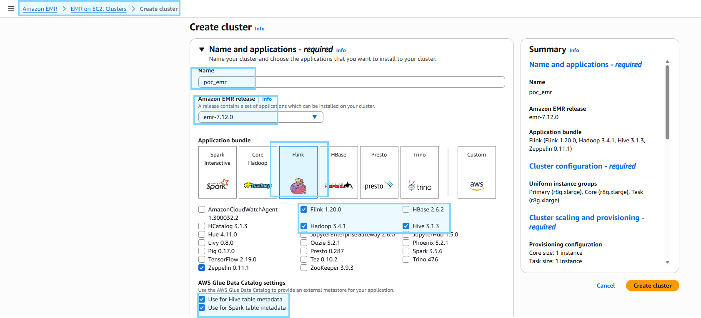
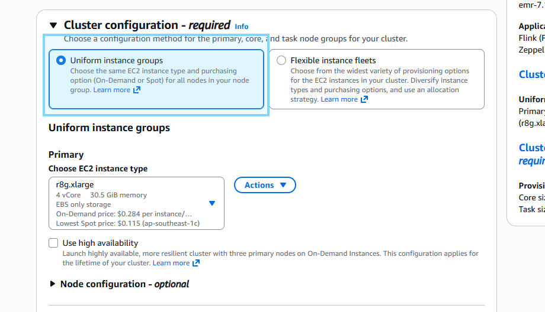
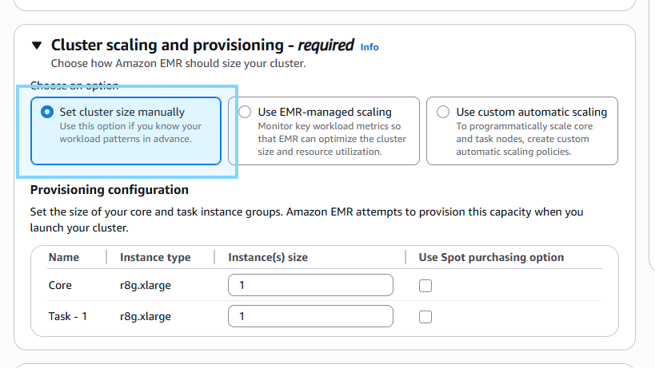
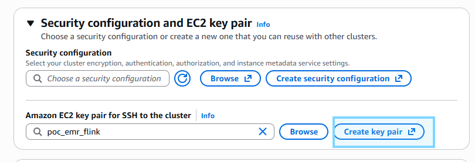
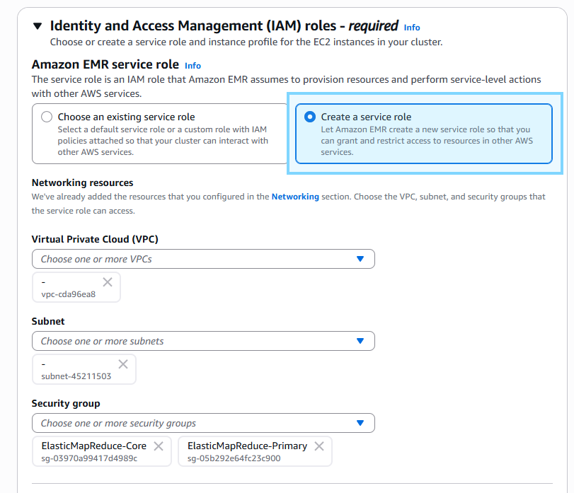
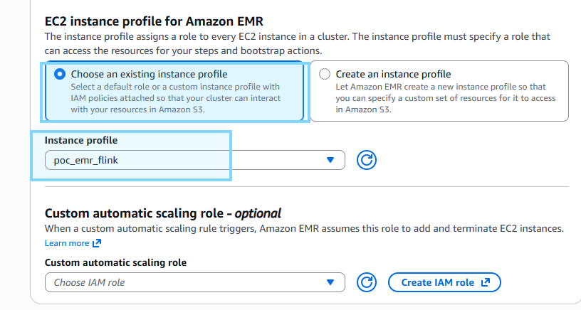
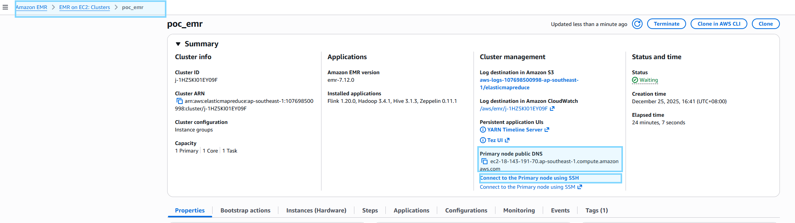

# Create AWS EMR Cluster
- **Name & choose bundle**



- **Uniform instance group**



- **Manual cluster scaling**



- **Create SSH key pair**
    - Save .pem key to `/keys` folder



- **Create new service role**



- **Create IAM role with IAM policies below**
    - `AmazonS3FullAccess`
    - `AmazonSSMManagedInstanceCore`
    - `AWSGlueConsoleFullAccess`



# SSH to Primary Node
- **Check Primary Node endpoint**



- **Update `.env` for `AWS_EMR_PRIMARY_NODE`**
```bash
./cli/ssh_primary_node.sh
```

# Download Custom Flink Libs Jar
- **Download Flink Libs Jar**
```bash
sudo wget -P /usr/lib/flink/lib/ https://repo1.maven.org/maven2/org/apache/flink/flink-sql-connector-kafka/3.3.0-1.20/flink-sql-connector-kafka-3.3.0-1.20.jar

sudo wget -P /usr/lib/flink/lib/ https://repo1.maven.org/maven2/org/apache/iceberg/iceberg-flink-runtime-1.20/1.7.1/iceberg-flink-runtime-1.20-1.7.1.jar

sudo wget -P /usr/lib/flink/lib/ https://repo1.maven.org/maven2/org/apache/iceberg/iceberg-aws-bundle/1.7.1/iceberg-aws-bundle-1.7.1.jar
```

# Create Flink Job

- **Start Flink session**
```bash
flink-yarn-session -d \
    -nm "session_iceberg" \                         # name
    -yD yarn.application.name="session_iceberg" \   # name
    -tm 4096 \                                      # RAM per Worker
    -s 2 \                                          # parallel tasks per node
```

- **Check Flink session list**
```bash
./cli/list_flink_session.sh
```

- **Delete Flink session**
```bash
yarn application -kill <APPLICATION_ID>
```

- **Flink-SQL-Client with specific Flink session**
```bash
./cli/flink_sql_client.sh <SESSION_NAME>
```

- **Create job**
- **Flink dashboard**
